# Hệ thống vệ sinh cửa kính cho nhà cao tầng
## 🚗 **MODEL**
### 3D Model

### Model 

## **Đặc tả hệ thống**
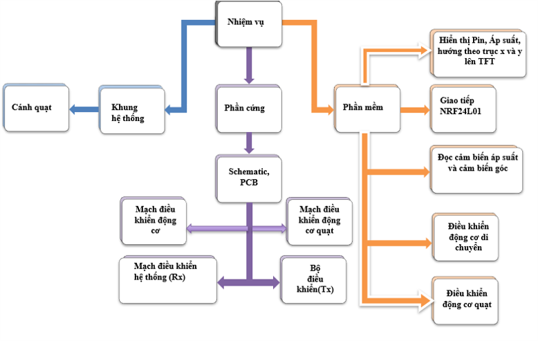
### Hệ thống được chia làm 4 mạch chính: 
- Mạch điều khiển động cơ di chuyển
- Mạch điều khiển động cơ quạt
- Mạch điều khiển hệ thống hoạt động (Rx)
- Mạch cho bộ điều khiển từ xa (Tx) 
- Mạch nguồn cho toàn bộ hệ thống
### Mạch điều khiển động cơ di chuyển (H Bridge Circuit) 
#### - Block Diagram cho mạch điều khiển động cơ di chuyển
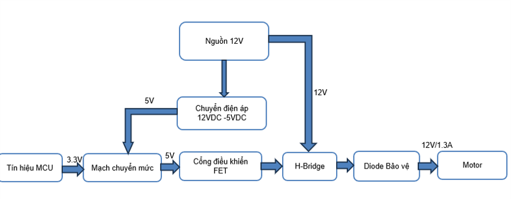
#### - Mô hình 3D từ Altium
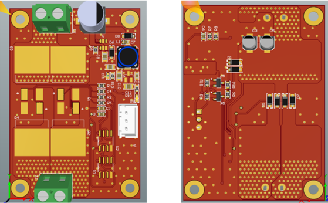
### Mạch điều khiển động cơ quạt
#### - Block Diagram cho mạch điều khiển động cơ quạt
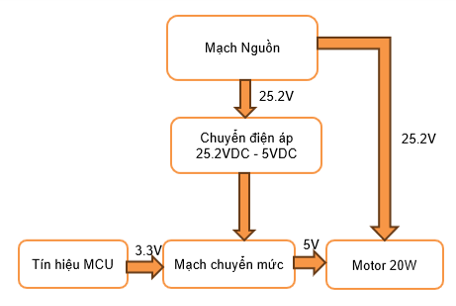
#### - Mô hình 3D từ Altium 

### Mạch điều khiển hệ thống hoạt động (Rx)
#### - Block Diagram cho mạch điều khiển hệ thống hoạt động 

#### - Mô hình 3D từ Altium
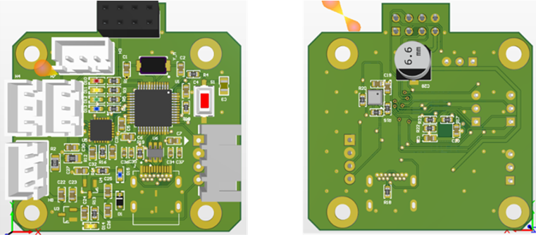
### Mạch cho bộ điều khiển từ xa (Tx)
#### - Block Diagram cho mạch
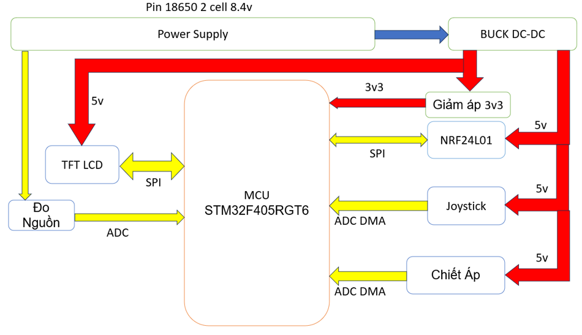
#### - Mô hình 3D từ Altium 
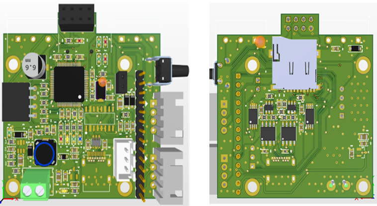
### Mạch nguồn hệ thống 
#### - Block Diagram cho mạch 

#### - Mô hình 3D từ Altium 
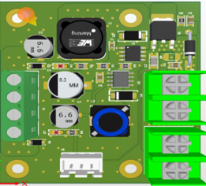
## **Giải thuật của hệ thống)
### **MẠCH RX** 
### - Giải thuật tổng quát cho mạch Rx 
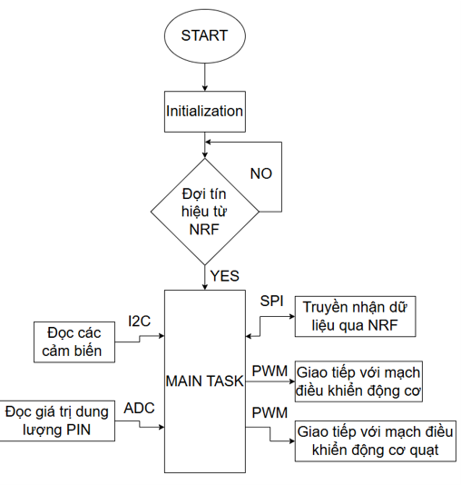
### - Giải thuật chi tiết và frame truyền nhận data cho mạch Rx 
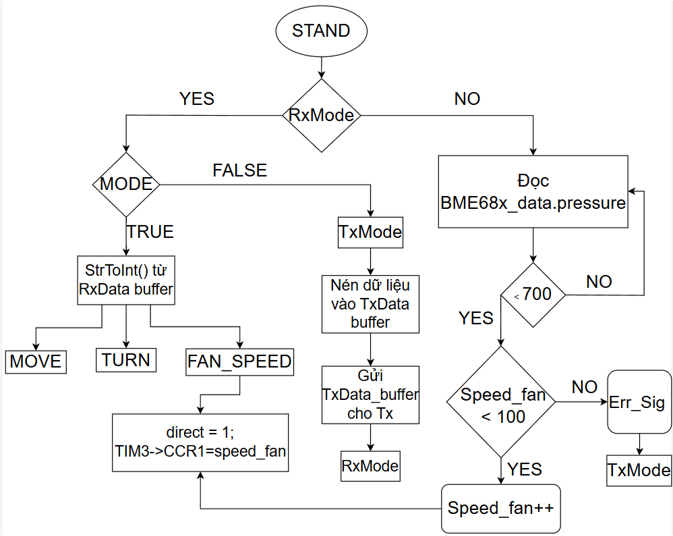
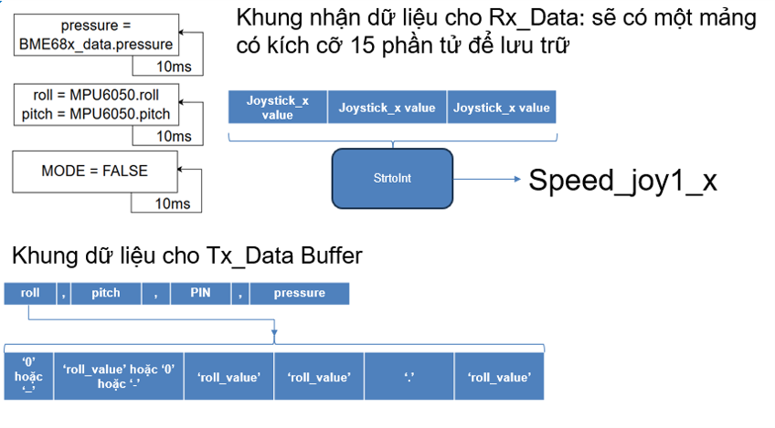
### **MẠCH TX** 
### - Giải thuật tổng quát cho mạch Tx 
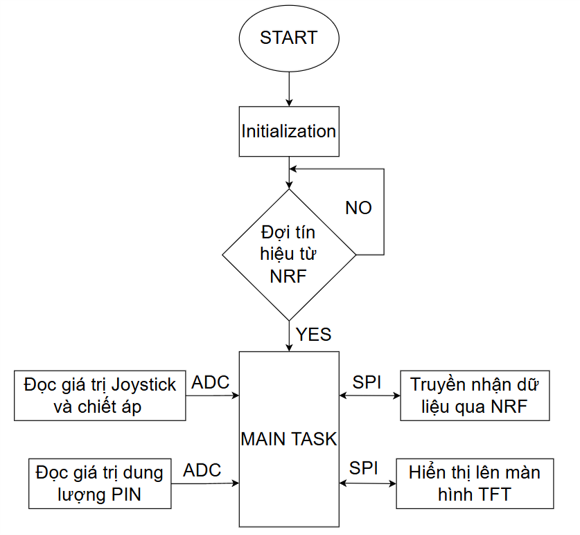
### - Giải thuật chi tiết và frame truyền nhận data cho mạch Tx 
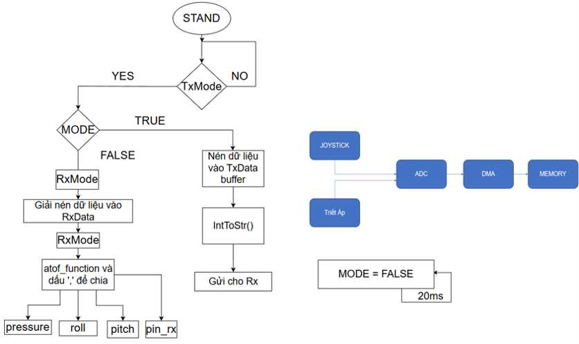

